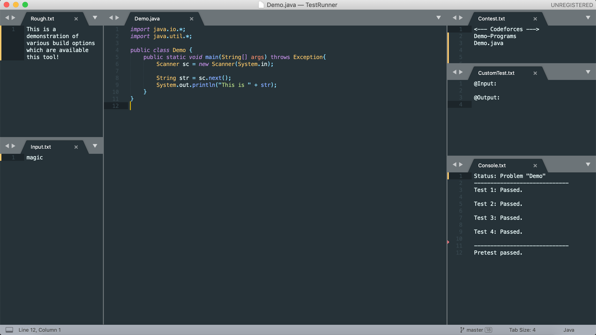

TestRunner is an application involving parsing and checking of the sample test cases of any programming contest. Project comprises of back-end Python programming and uses Sublime Text Editor as front-end UI. It allows you to run and debug your code in C++ and Java.

## Salient Features
* No need to manually enter test-cases every time you make a change in the program
* Parses test cases from coding platform to your local machine and automatically checks them with your program, so say goodbye to switching windows and copy-pasting times!
* Provides build options such as Debug and Random Test along with mainstream options for much better flexibility
* Supports programs written in C++ and Java
* Well-designed layout and arrangement scheme for better experience
* Works on UNIX, Windows and MacOS platforms

## Build Options
* * *
#### Parse Test
Parses all the sample tests of the contest name provided in the `Contest.txt` file and stores it. This test will be used whenever the respective code is ran. _(**Note:** This mode is available for Codeforces for now)_

#### Run Code
Compiles and runs program (provided in `Contest.txt`), compares the output with the tests that are parsed and one which is provided in the `CustomTest.txt` and show the results in `Console.txt`. One will notice that "CustomTest" will be cleared after execution, but that doesn't mean one have to provide that particular testcase again. Instead that testcase would have been added to program's saved testcases list.

#### Debug Mode
Bugs are everywhere and hence, one needs to debug. This build option takes input from the `Input.txt`, runs the code and shows the output in Sublime console.

#### Random Test
Generates the random test by running `filegen/RandomTest.cpp` file which can be seen in `Input.txt` and then, runs the code in Debug Mode. Note that, after you make any changes to your code, you should first run it on Debug mode and then run on RandomTest mode.

You can check out **DEMO** of this tool [here](https://raw.githubusercontent.com/harshvasoya008/TestRunner/gh-pages/testrunner-demo.mov).

